    <h1>Hai, I am Shaijo George</a> </h1>
    
      
    
🙏🏻 Welcome to my Github profile ! 
        I am a <b>Full Stack Developer</b> 🌠from <b>Kerala, India</b> 
        I love learning new technologies😠

    

        
          
    

    

        <h2>
            What I'm up to</h2>
        <ul>
            <li> 👨🏻‍💻 I'm a B.E(Computer Science Engineering) Graduate</li>
            <li> 🎓 I'm currently learning MERN Stack Development </li>
        </ul>
    

        <h2> Languages and Tools</h2>

 

  

 
    <h2 align="left"> 💻 My workspace:</h2> 
    

   
 
        
 
  
  
  

 

        <h2> &nbsp;My Stats
        </h2>
    

     
    

            

                
                
            
  
    

    
  

